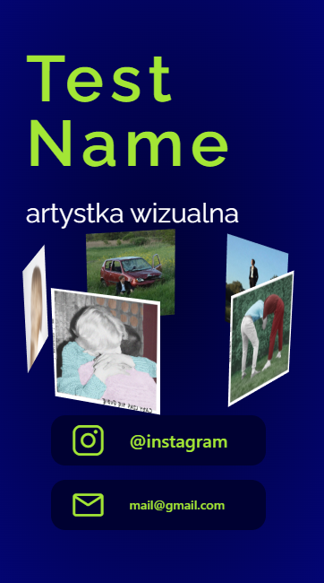
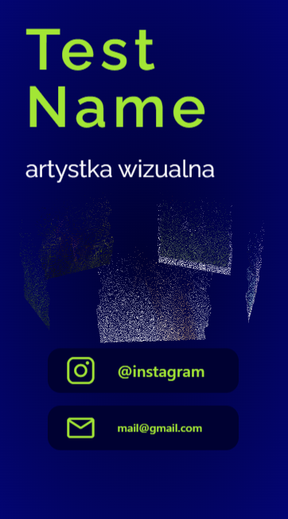

# Photo portfolio prototype
These meant to be a whole portfolio site for photo artist. (That's why there is so many boilerplate and packages)

For now it's just a prototype of a fade away 3D effect.

## screenshots

### Setup & run
Project uses vite and yarn so standard commands:

* `yarn install` - install dependencies
* `yarn dev` - run development server
* `yarn preview` - run preview
* `yarn build` - build whole project (`dist` directory)